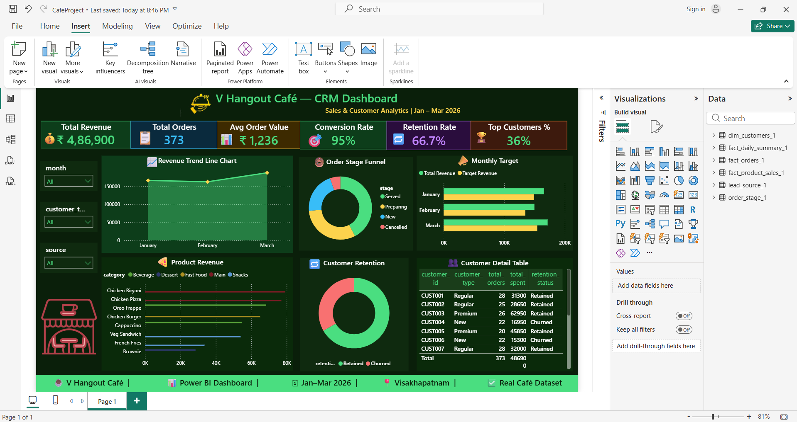

# cafe-crm-dashboard
Real-time CRM dashboard for V Hangout Café  built with SQL Server, Excel and Power BI

# ☕ V Hangout Café — CRM & Sales Analytics

> Real-time analytics project built on live 
> transactional data from V Hangout Café,
> Visakhapatnam | Jan – Mar 2026

---

## 📌 Project Overview

End-to-end CRM dashboard analyzing real customer 
behavior, revenue trends, product performance 
and churn patterns for a real café business.

---

## 🛠️ Tools & Technologies

| Tool | Purpose |
|------|---------|
| SQL Server | Database design & querying |
| Power BI | Dashboard & visualization |
| Excel | Data cleaning & modeling |
| DAX | Calculated measures |
| Power Query | Data transformation |

---

## 📊 Dashboard KPIs

| Metric | Value |
|--------|-------|
| Total Revenue | ₹4,86,900 |
| Total Orders | 373 |
| Avg Order Value | ₹1,236 |
| Conversion Rate | 95% |
| Retention Rate | 66.7% |
| Top 3 Customers | 36% revenue |

---

## 🗄️ Data Model

| Table | Type |
|-------|------|
| fact_orders | Fact |
| dim_customers | Dimension |
| fact_product_sales | Fact |
| fact_daily_summary | Fact |
| lead_source | Dimension |
| order_stage | Dimension |

---

## 💡 Key Business Insights

1. 📈 Revenue grew Jan → Feb → Mar 2026
2. ✅ 95% order conversion rate
3. ⚠️ 33% churn rate detected
4. 🏆 Chicken Biryani = top revenue product
5. 👑 Top 3 customers = 36% of revenue
6. 📣 Walk-in = #1 customer source

---

## 📸 Dashboard Preview

](https://github.com/sandeep-sandy123/cafe-crm-dashboard/blob/main/dashboard.png)

---

## 👤 Author

Sandeep | Data Analyst | Visakhapatnam
GitHub: github.com/sandeep-sandy123
